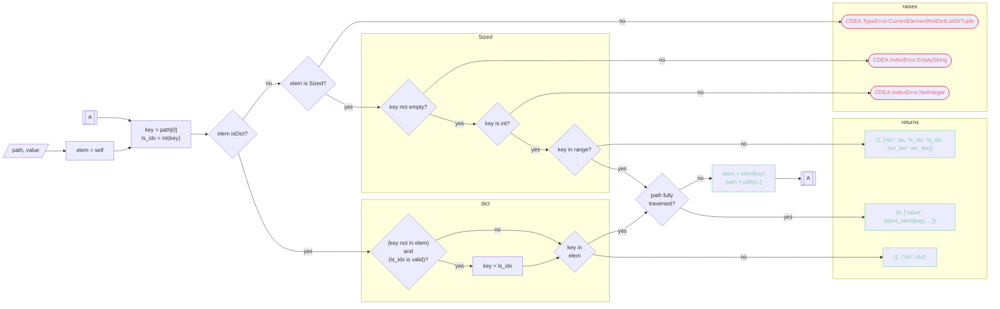
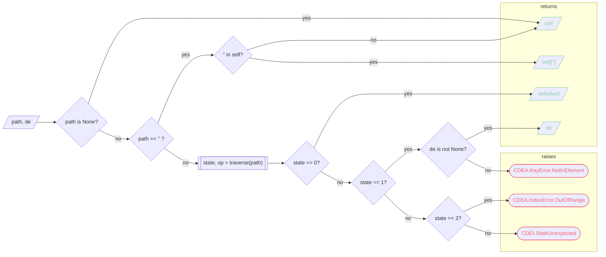
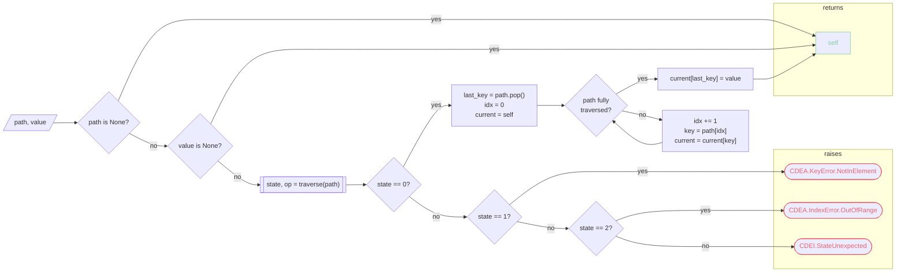
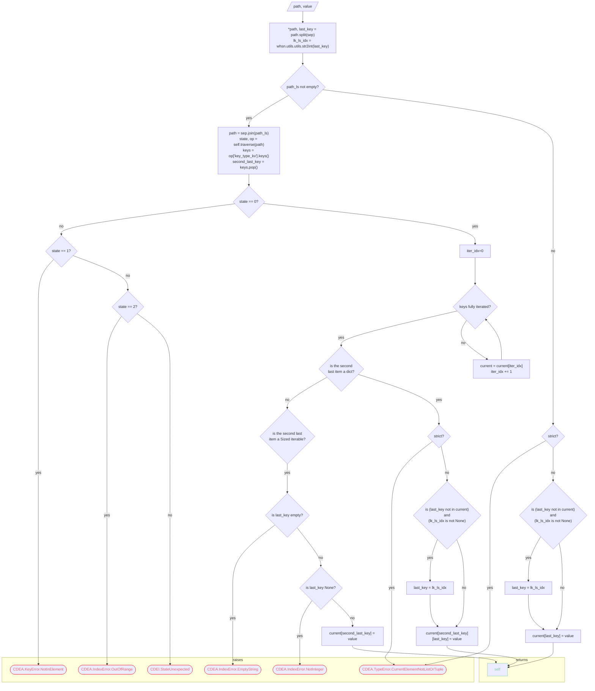

# **[whinesnips](README.md).[cd](cd.md)**

## Rationale

Well... I kinda' do some web scraping here and there, and this thing's real useful.

## Disclaimer

Let it be known that to this day, I am still trying to document the shittiness of this module.

Good Lord, have mercy on me huhuuuuu

## Usage

### Initialization

- Import the module.

    ```python
    from ${project_name}.cd import CustomDict
    ```

- Initialize empty dictionary...

    ```python
    test = cd.CustomDict()
    ```

    ```python
    print(test) # {}
    ```

    or from an existing dictionary

    ```python
    test = cd.CustomDict({"a": 1, "b": 2})
    ```

    ```python
    print(test) # {"a": 1, "b": 2}
    ```

### Insertion

- You can do it the old-fashioned way...

    ```python
    test = cd.CustomDict({"a": 1, "b": 2})
    ```

    ```python
    test["c"] = 3
    ```

    Or you can use the `insert` method

    ```python
    test.insert("c", 3)
    ```

    Both methods yield the same results

    ```python
    print(test["c"]) # 3
    ```

- You can also use a path-like string to insert a value.

    ```python
    test = cd.CustomDict({"a": {}})
    test.insert("a/b/c", 3)
    ```

    ```python
    print(test) # {"a": {"b": {"c": 3}}}
    ```

    Yes, it created the keys when they are non-existent. You probably would not want this, but I certainly do. Adding a flag to disable this behavior will only add complexity to it. And, this is my library of snippets to begin with, so just deal with it.

    No one would even probably read this, other than the author itself.

- When the path's value is a list, it will append the given value to the list.

    ```python
    test = cd.CustomDict({"a": [1, 2, 3]})
    test.insert("a/b/c", 4)
    ```

    ```python
    print(test) # {"a": [1, 2, 3, 4]}
    ```

### Getting Values

- You can do it the old-fashioned way...

    ```python
    test = cd.CustomDict({"a": 1, "b": 2})
    ```

    ```python
    print(test["a"]) # 1
    ```

    Or you can use the `dir` method

    ```python
    print(test.dir("a")) # 1
    ```

- You can also use a path-like string to get a value.

    ```python
    test = cd.CustomDict({"a": {"b": {"c": 3}}})
    ```

    ```python
    print(test.dir("a/b/c")) # 3
    ```

- The `dir` method will also return a `CustomDict` object if the value is a dictionary.

Well, that's a really rudimentary way to document it, but it works for me, and that is all that matters.

## How It Works

Hereunder mermaid graphs that explains how the logic of each functions in the class `CustomDict` works.

## traverse



## dir



## modify



## insert




<h3><b><a href="#func" id="func">Functions</a></b></h3>

    

    
<h3><b><i><a href="#func-flatten_element" id="func-flatten_element">flatten_element</a></i></b></h3>

```python
(elem: dict[int, typing.Any] | dict[str, typing.Any] | dict[int | str, typing.Any] | list[tuple[int | str, typing.Any]], sep: str = '/') ‑> whinesnips.cd.CustomDict
```

    

    
<h3><b><a href="#class" id="class">Classes</a></b></h3>

    
<h3><b><i><a href="#class-BEHAVIOR" id="class-BEHAVIOR">BEHAVIOR</a></i></b></h3>

```python
(*args, **kwds)
```

    
Create a collection of name/value pairs.

Example enumeration:

>>> class Color(Enum):
...     RED = 1
...     BLUE = 2
...     GREEN = 3

Access them by:

- attribute access::

>>> Color.RED
<Color.RED: 1>

- value lookup:

>>> Color(1)
<Color.RED: 1>

- name lookup:

>>> Color['RED']
<Color.RED: 1>

Enumerations can be iterated over, and know how many members they have:

>>> len(Color)
3

>>> list(Color)
[<Color.RED: 1>, <Color.BLUE: 2>, <Color.GREEN: 3>]

Methods can be added to enumerations, and members can have their own
attributes -- see the documentation for details.

    
<h3><a href="#class-BEHAVIOR-mro" id="class-BEHAVIOR-mro">Ancestors (in MRO)</a></h3>

* enum.Enum

    
<h3><a href="#class-BEHAVIOR-cvar" id="class-BEHAVIOR-cvar">Class variables</a></h3>

    
`append`

    
`insert`

    
`modify`

    
<h3><b><i><a href="#class-CustomDict" id="class-CustomDict">CustomDict</a></i></b></h3>

```python
(*args: dict[int, typing.Any] | dict[str, typing.Any] | dict[int | str, typing.Any] | list[tuple[int | str, typing.Any]], **kwargs: dict[str, typing.Any])
```

    
Custom dictionary.

    
<h3><a href="#class-CustomDict-mro" id="class-CustomDict-mro">Ancestors (in MRO)</a></h3>

* builtins.dict

    
<h3><a href="#class-CustomDict-func" id="class-CustomDict-func">Methods</a></h3>

    

    
<h3><i><a href="#class-CustomDict-func-append" id="class-CustomDict-func-append">append</a></i></h3>

```python
(self, path: str = 'c0VjUmVUX2NPZEUgYnkgd2hpX25l', value: Any = 'c0VjUmVUX2NPZEUgYnkgd2hpX25l', sep: str = '/') ‑> whinesnips.cd.CustomDict
```

    

    

    
<h3><i><a href="#class-CustomDict-func-dir" id="class-CustomDict-func-dir">dir</a></i></h3>

```python
(self, path: str = 'c0VjUmVUX2NPZEUgYnkgd2hpX25l', de: Any = 'c0VjUmVUX2NPZEUgYnkgd2hpX25l', sep: str = '/') ‑> Any
```

    

    

    
<h3><i><a href="#class-CustomDict-func-flatten" id="class-CustomDict-func-flatten">flatten</a></i></h3>

```python
(self, path: str = 'c0VjUmVUX2NPZEUgYnkgd2hpX25l', sep: str = '/', flat_sep: str = '/') ‑> whinesnips.cd.CustomDict
```

    

    

    
<h3><i><a href="#class-CustomDict-func-insert" id="class-CustomDict-func-insert">insert</a></i></h3>

```python
(self, path: str = 'c0VjUmVUX2NPZEUgYnkgd2hpX25l', value: Any = 'c0VjUmVUX2NPZEUgYnkgd2hpX25l', sep: str = '/', strict: bool = True) ‑> whinesnips.cd.CustomDict
```

    

    

    
<h3><i><a href="#class-CustomDict-func-modify" id="class-CustomDict-func-modify">modify</a></i></h3>

```python
(self, path: str = 'c0VjUmVUX2NPZEUgYnkgd2hpX25l', value: Any = 'c0VjUmVUX2NPZEUgYnkgd2hpX25l', sep: str = '/') ‑> whinesnips.cd.CustomDict
```

    

    

    
<h3><i><a href="#class-CustomDict-func-traverse" id="class-CustomDict-func-traverse">traverse</a></i></h3>

```python
(self, path: str, sep: str) ‑> tuple[int, dict[str, typing.Any]]
```

    
Given a path, traverse the element (self, which is a dictionary).

The function returns a tuple of integer and dictionary.
The integer is the return state. Hereunder return states,
their description and corresponding return's description.

| State | Description                       | Return Description                    |
|------:|----------------------------------:|:--------------------------------------|
| 0     | Path fully traversed              | Indexed Item                          |
| 1     | Path's not in element             | Kwargs for CDEA.KeyError.NotInElement |
| 2     | Path's current index not in range | Kwargs for CDEA.IndexError.OutOfRange |

When the path is fully traversed (state 0),
it gives out the following dictionary and the corresponding keys' types:

```python
    {
        "value": Any,
        "key_type_kv": dict[int | str, str],
    }
```

Whereas:

- `value` is the indexed item
- `key_type_kv` is key-value pair (dict) of keys that are used to
traverse the element and the type of the element traversed.
The keys will be evaluated so that list indexes will be in integer.
Or when an integer is used as a key in the element,
it will also show up as such in here.
The element type will be in string, and the only allowed ones are
`dict`, `list` and `tuple`.

Consider the following:

```python
test = CustomDict({"w": (["a", {"b": "c"}], ["d"])})
```

When traversed with the following:

```python
test.traverse("w/-2/+1/b")
```

The following should be returned:

```python
{
    "value": "c",
    "key_type_kv": {
        "w": "dict",
         -2: "tuple",
          1: "list",
        "b": "dict"
    },
}
```

    
<h8><b><a href="#class-CustomDict-func-traverse-args" id="class-CustomDict-func-traverse-args">Args:</a></b></h8>

    path (str): Path to traverse.
    sep (str): Seperator of the path for individual indexes.

    
<h8><b><a href="#class-CustomDict-func-traverse-raises" id="class-CustomDict-func-traverse-raises">Raises:</a></b></h8>

    CDExceptions.API.IndexError.EmptyString:
    Raised when the currently traversed element is a list or tuple,
    and the current key is an empty string.
    CDExceptions.API.IndexError.NotInteger:
    Raised when the currently traversed element is a list or tuple,
    and the current key is not a valid integer.
    CDExceptions.API.TypeError.CurrentElementNotDictListOrTuple:
    Raised when the currently traversed element is not the last element
    to index and is not a dict, list, or tuple.

    
<h8><b><a href="#class-CustomDict-func-traverse-returns" id="class-CustomDict-func-traverse-returns">Returns:</a></b></h8>

    tuple[int, dict[str, int]]: _description_