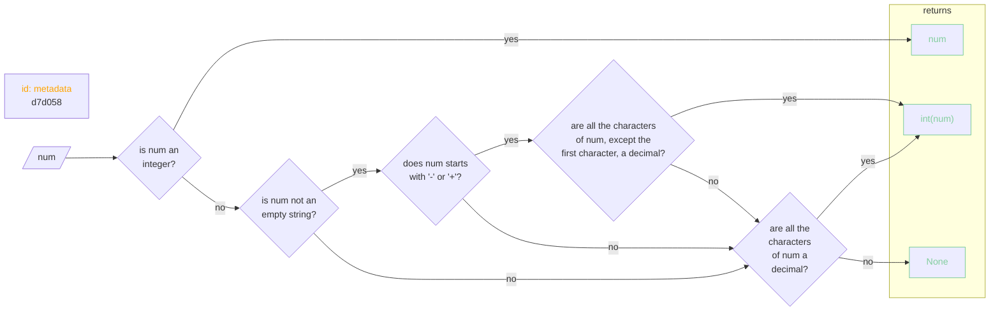

# **[whinesnips](../README.md).[utils](../utils.md).[utils](utils.md)**

## str2int




<h3><b><a href="#func" id="func">Functions</a></b></h3>

    

    
<h3><b><i><a href="#func-calc_hash" id="func-calc_hash">calc_hash</a></i></b></h3>

```python
(input: str) ‑> str
```

    
Given a string, calculate its hash and return it.

    
<h3><i><a href="#func-calc_hash-args" id="func-calc_hash-args">Args:</a></i></h3>

    input (str): String to hash.

    
<h3><i><a href="#func-calc_hash-returns" id="func-calc_hash-returns">Returns:</a></i></h3>

    str: Hash of the string.

    

    
<h3><b><i><a href="#func-cycle_2ls" id="func-cycle_2ls">cycle_2ls</a></i></b></h3>

```python
(a: collections.abc.Sized, b: collections.abc.Sized) ‑> collections.abc.Iterable[typing.Any]
```

    
Given two list, iterate through both of them, and cycle the shorter list until the longer list has been exhausted.

    
<h3><i><a href="#func-cycle_2ls-args" id="func-cycle_2ls-args">Args:</a></i></h3>

- a (`Sized`): First sized iterable.
- b (`Sized`): Second sized iterable.

    
<h3><i><a href="#func-cycle_2ls-returns" id="func-cycle_2ls-returns">Returns:</a></i></h3>

`Iterable[Any]`: _description_

    

    
<h3><b><i><a href="#func-dnn" id="func-dnn">dnn</a></i></b></h3>

```python
(fn: str, n: int) ‑> str
```

    
Dirname N-th times.

Given a file name and a number, find the parent directory of the given filename as many times as the given number.

    
<h3><i><a href="#func-dnn-args" id="func-dnn-args">Args:</a></i></h3>

- fn (`str`): The filename to find the parent directory of.
- n (`int`): How many times the parent directory of the given filename should be found.

    
<h3><i><a href="#func-dnn-returns" id="func-dnn-returns">Returns:</a></i></h3>

`str`: Parent directory of the given filename.

    

    
<h3><b><i><a href="#func-dnrp" id="func-dnrp">dnrp</a></i></b></h3>

```python
(file: str, n: Optional[int] = None) ‑> str
```

    
Get the directory component of a pathname by n times recursively then return it.

    
<h3><i><a href="#func-dnrp-args" id="func-dnrp-args">Args:</a></i></h3>

- file (`str`): File to get the directory of.
- n (`Optional[int]`, optional): Number of times to get up the directory???? Defaults to 1.

    
<h3><i><a href="#func-dnrp-returns" id="func-dnrp-returns">Returns:</a></i></h3>

`str`: The directory component got recursively by n times from the given pathname

    

    
<h3><b><i><a href="#func-dpop" id="func-dpop">dpop</a></i></b></h3>

```python
(d: dict[typing.Any, typing.Any], pop: list[int | list[str | int | tuple[str, ...]] | str], de: Optional[Any] = None) ‑> Any
```

    
Iterate through the preferred order of precedence (`pop`) and see if the value exists in the dictionary. If it does, return it. If not, return `de`.

    
<h3><i><a href="#func-dpop-args" id="func-dpop-args">Args:</a></i></h3>

- d (`Dict[Any, Any]`): Dictionary to retrieve the value from.
- pop (`list[int | tuple[str | int | tuple] | str]`): List of keys to iterate through.
- de (`Any`, optional): Default object to be returned. Defaults to None.

    
<h3><i><a href="#func-dpop-returns" id="func-dpop-returns">Returns:</a></i></h3>

`Any`: Retrieved value.

    

    
<h3><b><i><a href="#func-dt_ts" id="func-dt_ts">dt_ts</a></i></b></h3>

```python
(ts: str) ‑> str
```

    
Convert the given unix timestamp to ISO 8601 format.

    
<h3><i><a href="#func-dt_ts-args" id="func-dt_ts-args">Args:</a></i></h3>

- ts (`str`): unix timestamp to be converted to ISO 8601 format

    
<h3><i><a href="#func-dt_ts-returns" id="func-dt_ts-returns">Returns:</a></i></h3>

`str`: Formatted datetime string

    

    
<h3><b><i><a href="#func-file_exists" id="func-file_exists">file_exists</a></i></b></h3>

```python
(fp: str) ‑> str
```

    
Check if the given file path exists.

    
<h3><i><a href="#func-file_exists-args" id="func-file_exists-args">Args:</a></i></h3>

- fp (`str`): File path to check if it exists.

    
<h3><i><a href="#func-file_exists-raises" id="func-file_exists-raises">Raises:</a></i></h3>

- `exceptions.GeneralExceptions.ValidationError.FileNotFound`: Raised when a file in the path is not found.

    
<h3><i><a href="#func-file_exists-returns" id="func-file_exists-returns">Returns:</a></i></h3>

`str`: Return `fp` when file path exists.

    

    
<h3><b><i><a href="#func-fill_ls" id="func-fill_ls">fill_ls</a></i></b></h3>

```python
(*, ls: collections.abc.Sequence[typing.Any], length: int, filler: Optional[Any] = None) ‑> collections.abc.Sequence[typing.Any]
```

    
Fill given list (`ls`) with `filler` up to `length`.

    
<h3><i><a href="#func-fill_ls-args" id="func-fill_ls-args">Args:</a></i></h3>

- ls (`types.SequenceAny`): List to fill with `filler` up to `length`
- length (`int`): Length of the list to achieve.
- filler (`Optional[Any]`, optional): Filler to use. Defaults to `None`.

    
<h3><i><a href="#func-fill_ls-returns" id="func-fill_ls-returns">Returns:</a></i></h3>

`types.SequenceAny`: Filled list.

    

    
<h3><b><i><a href="#func-inmd" id="func-inmd">inmd</a></i></b></h3>

```python
(fp: str, ls: Optional[list[str]] = None) ‑> str
```

    
If given file path is not a directory, make one of the same name.

    
<h3><i><a href="#func-inmd-args" id="func-inmd-args">Args:</a></i></h3>

- fp (`str`): File path to check if it is a directory, and if not, to make one of the same name.
- ls (`Optional[list[str]]`, optional): A list of string to which this function can append the file path to if the given file path is not a directory. Defaults to `None`.

    
<h3><i><a href="#func-inmd-returns" id="func-inmd-returns">Returns:</a></i></h3>

`str`: Given filepath.

    

    
<h3><b><i><a href="#func-iter_ls_with_items" id="func-iter_ls_with_items">iter_ls_with_items</a></i></b></h3>

```python
(ls: list[typing.Any], *items: list[typing.Any]) ‑> collections.abc.Generator[tuple[typing.Any, ...], None, None]
```

    

    

    
<h3><b><i><a href="#func-ivnd" id="func-ivnd">ivnd</a></i></b></h3>

```python
(var: Any, de: Any) ‑> Any
```

    
"If Var None, Default".

If `var` is `None`, return `de` else `var`.

    
<h3><i><a href="#func-ivnd-args" id="func-ivnd-args">Args:</a></i></h3>

- var (`Any`): Variable to check if it is None.
- de (`Any`): Default value to return if var is None.

    
<h3><i><a href="#func-ivnd-returns" id="func-ivnd-returns">Returns:</a></i></h3>

`Any`: `var` if `var` is not None else `de`.

    

    
<h3><b><i><a href="#func-le" id="func-le">le</a></i></b></h3>

```python
(expr: str) ‑> Any
```

    
Literal Evaluation.

    
<h3><i><a href="#func-le-args" id="func-le-args">Args:</a></i></h3>

- expr (`str`): Expression to be evaluated.

    
<h3><i><a href="#func-le-returns" id="func-le-returns">Returns:</a></i></h3>

`Any`: Expression literally evaluated.

    

    
<h3><b><i><a href="#func-noop" id="func-noop">noop</a></i></b></h3>

```python
(*args: list[typing.Any], **kwargs: dict[str, typing.Any]) ‑> None
```

    
No operation.

    

    
<h3><b><i><a href="#func-noop_single_kwargs" id="func-noop_single_kwargs">noop_single_kwargs</a></i></b></h3>

```python
(arg: Any) ‑> Any
```

    

    

    
<h3><b><i><a href="#func-repl" id="func-repl">repl</a></i></b></h3>

```python
(s: str, repl_dict: dict[str, list[str]]) ‑> str
```

    
Iterate through the dictionary, find the values in the given string and replace it with the corresponding key, and output the modified string.

    
<h3><i><a href="#func-repl-args" id="func-repl-args">Args:</a></i></h3>

- s (`str`): String to modify the contents of.
- repl_dict (`dict[str, list[str]]`): Key-value pairs of string to replace the substring with and list of string to replace with the corresponding key.

    
<h3><i><a href="#func-repl-returns" id="func-repl-returns">Returns:</a></i></h3>

`str`: Modified string.

    

    
<h3><b><i><a href="#func-rfnn" id="func-rfnn">rfnn</a></i></b></h3>

```python
(*args: list[typing.Any]) ‑> Any
```

    
Return First Non-None.

Return the first argument that is not `None`, else return `None`.

    
<h3><i><a href="#func-rfnn-returns" id="func-rfnn-returns">Returns:</a></i></h3>

`Any`: The first argument that is not `None`, else `None`.

    

    
<h3><b><i><a href="#func-run_cmd" id="func-run_cmd">run_cmd</a></i></b></h3>

```python
(cmd: str) ‑> None
```

    
Given a string, execute it as a shell command.

    
<h3><i><a href="#func-run_cmd-args" id="func-run_cmd-args">Args:</a></i></h3>

- cmd (`str`): Shell command to excute.

    

    
<h3><b><i><a href="#func-run_mp" id="func-run_mp">run_mp</a></i></b></h3>

```python
(func: collections.abc.Callable[..., typing.Any], iterable: collections.abc.Iterable[typing.Any]) ‑> list[typing.Any]
```

    

    

    
<h3><b><i><a href="#func-run_mp_qgr" id="func-run_mp_qgr">run_mp_qgr</a></i></b></h3>

```python
(func: collections.abc.Callable[..., typing.Any], iterable: collections.abc.Iterable[typing.Any]) ‑> tuple[None] | tuple[typing.Any] | tuple[typing.Any, ...]
```

    

    

    
<h3><b><i><a href="#func-run_mp_qir" id="func-run_mp_qir">run_mp_qir</a></i></b></h3>

```python
(func: collections.abc.Callable[..., typing.Any], iterable: collections.abc.Iterable[typing.Any], callback: collections.abc.Callable[..., typing.Any]) ‑> None
```

    
Run `multiprocessing.Pool().map_async()`, and quit in return.

Iterate over `iterable` and apply iterated item to `func` asynchronously. Wait for a single process in the pool to return, and terminate the pool.

This function requires the given function to return a bool, or an iterable with its first item as a bool. This bool is then used to decide whether to trigger the callback and terminate the pool.

    

    
<h3><b><i><a href="#func-run_mp_star" id="func-run_mp_star">run_mp_star</a></i></b></h3>

```python
(func: collections.abc.Callable[..., typing.Any], iterable: collections.abc.Iterable[collections.abc.Iterable[typing.Any]]) ‑> list[typing.Any]
```

    

    

    
<h3><b><i><a href="#func-run_mp_star_qgr" id="func-run_mp_star_qgr">run_mp_star_qgr</a></i></b></h3>

```python
(func: collections.abc.Callable[..., typing.Any], iterable: collections.abc.Iterable[collections.abc.Iterable[typing.Any]]) ‑> tuple[None] | tuple[typing.Any] | tuple[typing.Any, ...]
```

    

    

    
<h3><b><i><a href="#func-run_mp_star_qir" id="func-run_mp_star_qir">run_mp_star_qir</a></i></b></h3>

```python
(func: collections.abc.Callable[..., typing.Any], iterable: collections.abc.Iterable[collections.abc.Iterable[typing.Any]], callback: collections.abc.Callable[..., typing.Any]) ‑> None
```

    
Run `multiprocessing.Pool().starmap_async()`, and quit in return.

Iterate over `iterable` and apply iterated items to `func` asynchronously. Wait for a single process in the pool to return, and terminate the pool.

    

    
<h3><b><i><a href="#func-sanitize_text" id="func-sanitize_text">sanitize_text</a></i></b></h3>

```python
(s: str) ‑> str
```

    
Sanitize input text.

Reference: https://stackoverflow.com/a/93029

    
<h3><i><a href="#func-sanitize_text-args" id="func-sanitize_text-args">Args:</a></i></h3>

- s (`str`): Text to be sanitized.

    
<h3><i><a href="#func-sanitize_text-returns" id="func-sanitize_text-returns">Returns:</a></i></h3>

`str`: Sanitized text.

    

    
<h3><b><i><a href="#func-squery" id="func-squery">squery</a></i></b></h3>

```python
(query: str, possibilities: list[str], cutoff: int | float = 0.6, *, processor: collections.abc.Callable[[typing.Any], typing.Any] = <function <lambda>>) ‑> collections.abc.Generator[tuple[None, str] | tuple[float, str], None, None]
```

    
Custom search query.

    
<h3><i><a href="#func-squery-args" id="func-squery-args">Args:</a></i></h3>

- query (`str`): String to search for in the possibilities.
- possibilities (`list[str]`): The possibilities to search from.
- cutoff (`int | float`, optional): The minimum percentage of similarity from the given possibilities. Defaults to `0.6`.
- processor (`Callable[[Any], Any]`, optional): Processes the possibilities before comparing it with the query. Defaults to `lambda x: x`.

    
<h3><i><a href="#func-squery-returns" id="func-squery-returns">Returns:</a></i></h3>

`Generator[tuple[None, str] | tuple[float, str], None, None]`: Generator object of mastching search quries.

    

    
<h3><b><i><a href="#func-str2int" id="func-str2int">str2int</a></i></b></h3>

```python
(num: int | str) ‑> Optional[int]
```

    
If given number is int, return it. Else, if given number is string and is decimal, convert string to integer. Otherwise, return None.

    
<h3><i><a href="#func-str2int-args" id="func-str2int-args">Args:</a></i></h3>

    s (int | str): int or string to convert to integer.

    
<h3><i><a href="#func-str2int-returns" id="func-str2int-returns">Returns:</a></i></h3>

    Optional[int]: If given argument can be converted to integer, it will be returned. Otherwise, None will be.

    

    
<h3><b><i><a href="#func-vls_str" id="func-vls_str">vls_str</a></i></b></h3>

```python
(vls: list[str | int]) ‑> list[str]
```

    
Given the list of version numbers, convert them to their string representation both in modified semver form and semver-compliant form.

    
<h3><i><a href="#func-vls_str-args" id="func-vls_str-args">Args:</a></i></h3>

- vls (`list[str | int]`): List of version numbers.

    
<h3><i><a href="#func-vls_str-returns" id="func-vls_str-returns">Returns:</a></i></h3>

`list[str]`: List of string representation of given list of version numbers, both in modified semver form and semver-compliant form.

    

    
<h3><b><i><a href="#func-which_ls" id="func-which_ls">which_ls</a></i></b></h3>

```python
(cmd: str, mode: Optional[int] = None, path: Optional[str] = None) ‑> Union[tuple[str], tuple[str, ...], ForwardRef(None)]
```

    
Given a command, mode, and a PATH string, return the path which conforms to the given mode on the PATH, or None if there is no such file. Yoinked from shutil.

    
<h3><i><a href="#func-which_ls-args" id="func-which_ls-args">Args:</a></i></h3>

    mode (Optional[int], optional): File mode to look for. Defaults to `os.F_OK | os.X_OK`.
    path (Optional[str], optional): Path to search the command at. Defaults to the result of os.environ.get("PATH").

    
<h3><i><a href="#func-which_ls-returns" id="func-which_ls-returns">Returns:</a></i></h3>

    Optional[types.TupleStr]: Tuple of commands that conforms to the given arguments as said above.

    

    
<h3><b><i><a href="#func-yaml_str_presenter" id="func-yaml_str_presenter">yaml_str_presenter</a></i></b></h3>

```python
(dumper, data)
```

    

    
<h3><b><a href="#class" id="class">Classes</a></b></h3>

    
<h3><b><i><a href="#class-CallbackGetResult" id="class-CallbackGetResult">CallbackGetResult</a></i></b></h3>

```python
()
```

    

    
<h3><a href="#class-CallbackGetResult-func" id="class-CallbackGetResult-func">Methods</a></h3>

    

    
<h3><i><a href="#class-CallbackGetResult-func-callback" id="class-CallbackGetResult-func-callback">callback</a></i></h3>

```python
(self, *args: tuple[typing.Any, ...]) ‑> None
```

    

    

    
<h3><i><a href="#class-CallbackGetResult-func-get" id="class-CallbackGetResult-func-get">get</a></i></h3>

```python
(self) ‑> tuple[None] | tuple[typing.Any, ...]
```

    

    
<h3><b><i><a href="#class-PoolTerminate" id="class-PoolTerminate">PoolTerminate</a></i></b></h3>

```python
(pool: multiprocessing.pool.Pool, callback: collections.abc.Callable[..., typing.Any])
```

    

    
<h3><a href="#class-PoolTerminate-func" id="class-PoolTerminate-func">Methods</a></h3>

    

    
<h3><i><a href="#class-PoolTerminate-func-inner" id="class-PoolTerminate-func-inner">inner</a></i></h3>

```python
(self, err: bool, *args: tuple[typing.Any, ...], **kwargs: dict[str, typing.Any]) ‑> None
```